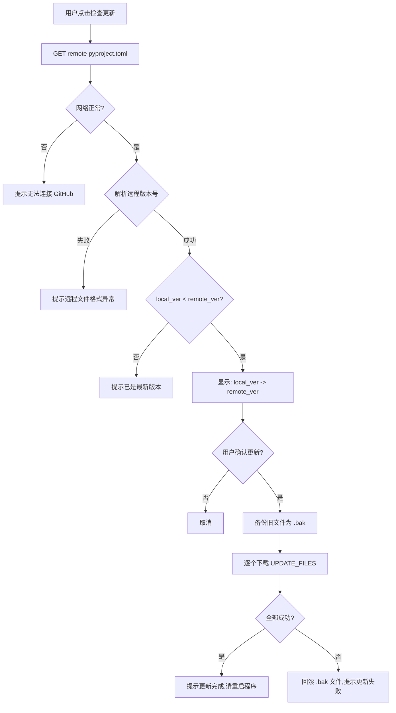

# 通过 GitHub API 实现自动更新功能

## 背景

- 用户通过下载 zip 包获取程序，本地**没有 `.git` 目录**
- 无法使用 dulwich/git pull 方案
- GitHub 仓库为公开仓库：`zhiquanchi/awin-rpa`，可直接使用无认证的 GitHub API
- 版本号通过 `pyproject.toml` 中的 `version` 字段管理（当前 `0.1.0`）
- 更新范围：**只覆盖代码文件**（.py, .tcss），保留用户数据文件

## 核心设计

版本判断基于 `pyproject.toml` 中的 `version` 字段（语义化版本），不依赖 Git SHA。

需要更新的代码文件清单（硬编码白名单）：

- `main.py`
- `tui_app.py`
- `tui_app.tcss`
- `pyproject.toml`

不更新的用户数据文件：

- `clicked_publisher_ids.txt`
- `seen_publisher_ids.txt`
- `awin_audit.jsonl`
- `tui_config.json`
- `messages.json`（或其他用户模板配置）
- `html_dumps/` 目录

## 实现方案

### 1. 新建 Updater 类（写在 [main.py](main.py) 中，放在 VersionManager 类之后）

```python
import urllib.request
import urllib.error

GITHUB_REPO = "zhiquanchi/awin-rpa"
GITHUB_BRANCH = "master"
UPDATE_FILES = ["main.py", "tui_app.py", "tui_app.tcss", "pyproject.toml"]

class Updater:
    def __init__(self, base_dir: Path = None):
        self.base_dir = base_dir or Path(__file__).parent
        self.version_manager = VersionManager(self.base_dir)

    def check_for_updates(self) -> dict:
        """通过 GitHub API 获取远程 pyproject.toml 的版本号并与本地对比"""
        # GET https://raw.githubusercontent.com/{repo}/{branch}/pyproject.toml
        # 解析 version 字段，与本地 version_manager.get_current_version() 比较
        # 返回 {"has_update": bool, "local_version": str, "remote_version": str}

    def download_updates(self) -> dict:
        """下载 UPDATE_FILES 中的每个文件，覆盖本地"""
        # 备份旧文件为 .bak
        # 从 raw.githubusercontent.com 下载每个文件
        # 写入本地，返回 {"success": bool, "updated_files": list, "message": str}
```

关键实现细节：

- 使用 Python 标准库 `urllib.request`（无需新增依赖）
- 远程文件 URL 格式：`https://raw.githubusercontent.com/zhiquanchi/awin-rpa/master/{filename}`
- 更新前备份旧文件为 `{filename}.bak`，失败时可回滚
- 版本比较使用 `packaging.version` 或简单的字符串拆分比较

### 2. main.py 终端菜单入口

在**主菜单**（`get_user_input()` 方法，约第 1056 行）中添加选项：

```
"🚀 开始执行 RPA",
"⚙️ 设置模式 (管理邀请信息)",
"🔄 重置已点击记录",
"📦 版本管理",
"🔍 检查更新",            <-- 新增，放在主菜单而非版本管理子菜单
"❌ 退出"
```

新增 `_check_update_flow()` 方法：

1. 显示"正在检查更新..."
2. 调用 `updater.check_for_updates()`
3. 无更新 -> 显示"当前已是最新版本 (x.y.z)"
4. 有更新 -> 显示"发现新版本: x.y.z -> a.b.c，是否更新？"
5. 确认后调用 `updater.download_updates()`
6. 成功后提示"更新完成，请重新启动程序以生效"

### 3. tui_app.py TUI 界面入口

在执行区域按钮区添加"检查更新"按钮，与"连接浏览器"和"重置记录"并列：

```python
yield Button("检查更新", id="btn-check-update", variant="primary", classes="btn-update")
```

新增方法：

- `action_check_update()`：触发后台检查
- `_check_update_worker()`：`@work(thread=True)`，后台 HTTP 请求
- `_handle_update_confirm(confirmed)`：确认后下载文件，日志区显示进度
- 更新成功后在日志区提示重启

### 4. 错误处理




### 5. 不需要额外依赖

- HTTP 请求：`urllib.request`（标准库）
- 版本比较：简单元组比较 `tuple(map(int, ver.split(".")))` 即可
- 无需引入 `requests` 或 `packaging`

